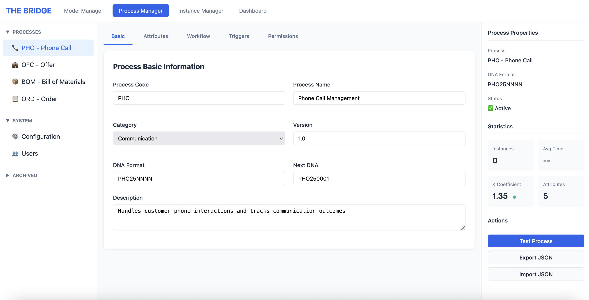
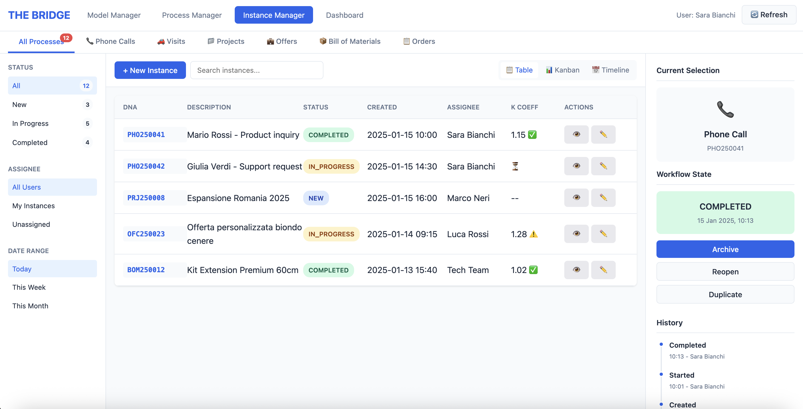
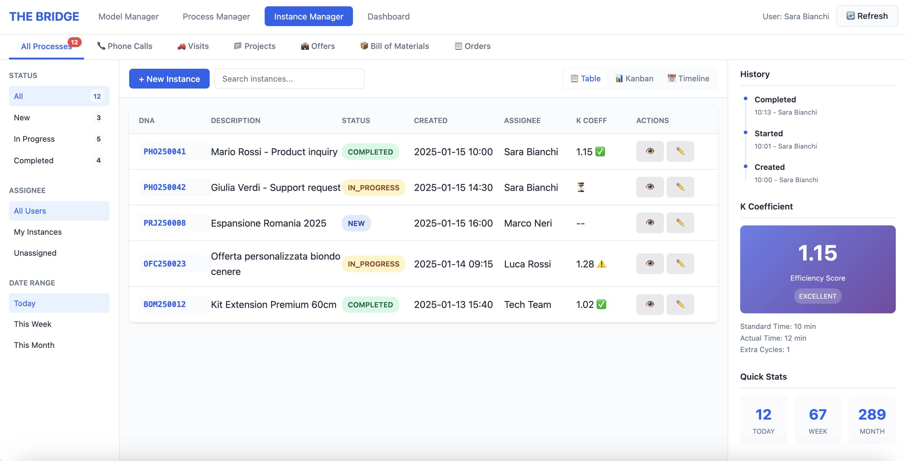

# 7. User Interface Design

## 7.1 UI Rules
- **Keep layouts light** — avoid heavy portals and unnecessary objects.
- **Use scripted finds / ExecuteSQL** for lists and filtered views (fast, targeted reads).
- **Cache Template JSON** for the session when safe (invalidate on template/version change).
- **Defer expensive renders** — load detail panes lazily after list selection.
- **Minimize redraws** — prefer one WebViewer render fed by JSON over many native widgets.
- **Consistent components** — reuse buttons, menus, and patterns across screens.
- **Keyboard-first** where possible — tab order, quick actions, Enter-to-commit.
- **Clear feedback** — toasts/spinners for long ops; disable buttons during actions.
- **Error surfaces** — inline, human-readable, with remediation hints.

## 7.2 UI References

### 7.2.1 Process Manager

### 7.2.2 Instance Manager

## 7.3 The Process Manager
### 7.3.1 Ontological Definition
The **Process Manager** is not a form configurator. It is the tool that defines the **business ontology** — the living structure of how processes, attributes, and relationships are represented in the organization.

### 7.3.2 Revolutionary Principle: [ Defining processes = Defining the organization. ]
- **Process present in the system** → Existing business capability  
- **Process absent** → Missing business capability  
This means the Process Manager directly reflects the organization’s operational map. Building processes is literally designing the organization.

### 7.3.3 Three-Panel Architecture
#### 7.3.3.1 PANEL 1 – Hierarchical TreeView (Left)
- Displays **all processes** in a hierarchical tree.  
- Defines **parent–child ontological relationships**.  
- Supports **add**, **delete**, **move**, and **nest** operations.  
- Example: `COMPANY → TASK → PHONE CALL → FOLLOW-UP`

#### 7.3.3.2 PANEL 2 – Attributes
- Lists all **attributes** for the selected process.  
- Each attribute includes **meta-properties** (see Part 3).  
- Automatically **generates the user interface** from the defined attributes.

#### 7.3.3.3 PANEL 3 – Composition
- Defines **operational relationships** between processes.  
- Configures **automatic/manual triggers**.  
- Establishes **dependencies and workflow orchestration** between processes.
