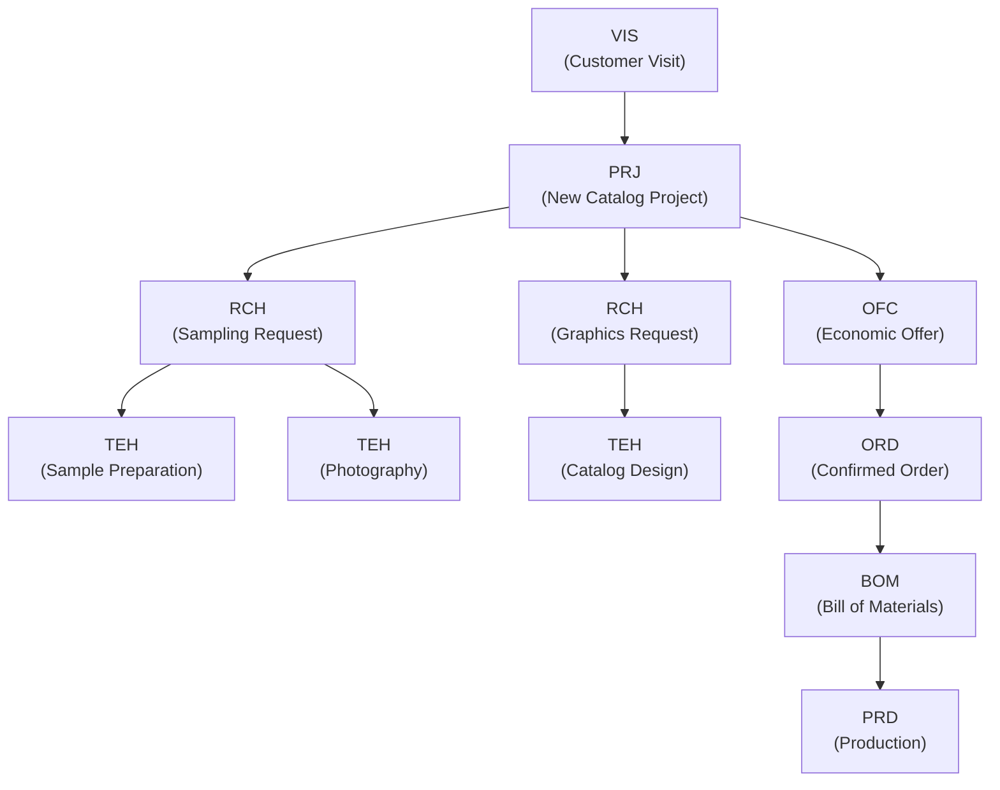

This section outlines how entities in the system activate one another through **operational chains** and **triggers**, forming a seamless workflow from initial customer interaction to final production.

___

## 11.1 Operational Flow Example



---

### 11.1.1 Flow Breakdown

- **VIS**: Captures customer needs and interest level.
- **PRJ**: Creates a structured project if interest is high.
- **RCH & TEH**: Handle technical and sampling requests, broken down by task type.
- **OFC → ORD**: Offer is prepared and, if accepted, moves into order confirmation.
- **BOM → PRD**: Final production logistics triggered by confirmed order.

This flow allows seamless downstream activation, with each process inheriting data attributes from its parent context for accuracy and traceability.

___

## 11.2 Trigger System

The system uses a **three-level trigger architecture** to drive both automation and decision support during the workflow.

#### 1. Automatic Trigger (Always Executed)

```pseudo
IF visit.outcome = "high_interest"
THEN create_project (inherit_client_data)
```

- Executed immediately.
- No user intervention required.
- Example: A high-interest visit automatically creates a project with pre-filled client data.

#### 2. Manual Trigger (Suggested to User)

```pseudo
IF project.status = "approved"
SUGGEST ["Create technical requests", "Prepare offer", "Schedule meeting"]
```

- Presented as actionable suggestions in the UI.
- User selects which actions to execute.
- Encourages best practices without forcing workflows.

#### 3. Conditional Trigger (Business Rule-Based)

```pseudo
IF order.value > 10000 AND client.category = "new"
THEN require_approval(level="director")
```

- Enforces company policies.
- Can block progression until conditions are met.
- Supports escalation logic based on financial or legal thresholds.

___

## 11.3 Key Benefits

- **Traceable** entity lifecycle from visit to production.
- **Scalable** behavior framework for all process types.
- **Hybrid** automation (system + user) to balance speed and control.
- **Data inheritance** ensures efficient and consistent hand-offs between processes.
