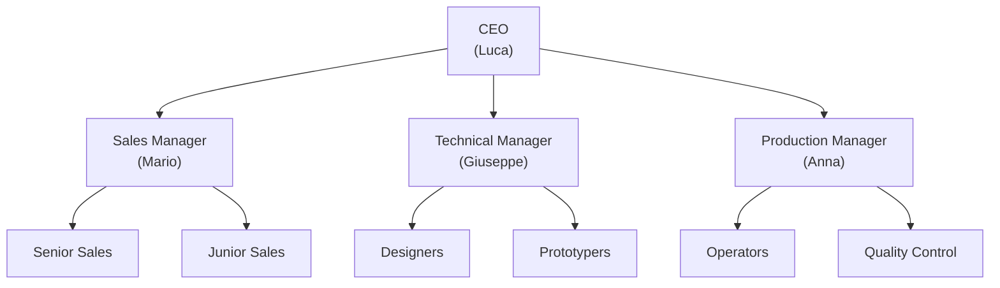

## 12.1 Triple Responsibility System

### 12.1.1 The Standard
| Role | Meaning |
|------|---------|
| **User** | The person who physically executes the action (inputs, uploads, performs task) |
| **Responsible** | The process owner who ensures the task is completed |
| **Controller** | The person who verifies timing, quality, and compliance |

---

### 12.1.2 Phone Call Example
| Role | Person | Function |
|-------|--------|----------|
| **User** | Sara | Enters call data, fills form, executes task |
| **Responsible** | Mario (Sales Manager) | Oversees PHO process and follow-ups |
| **Controller** | Director | Verifies performance, KPIs, and compliance |

---

## 12.2 Organizational Hierarchy Example

---

## 12.3 Notification and Escalation System

### 12.3.1 Rules (Structured)
| Type | Rule |
|------|------|
| **Immediate notification** | When a **task is assigned**, the *User* is notified instantly |
| **Escalation after 24h** | If task remains incomplete → escalate: **Task → Responsible → Manager → Director** |
| **Broadcasting** | **Critical events** are broadcast to multiple teams (e.g., blocked workflows, failed triggers, expired SLAs) |

---

### 12.3.2 Rules (Verbatim)
- **Immediate notification:** Task assigned  
- **Escalation after 24h:** Task → Responsible → Manager → Director  
- **Broadcasting:** Critical events to multiple teams
