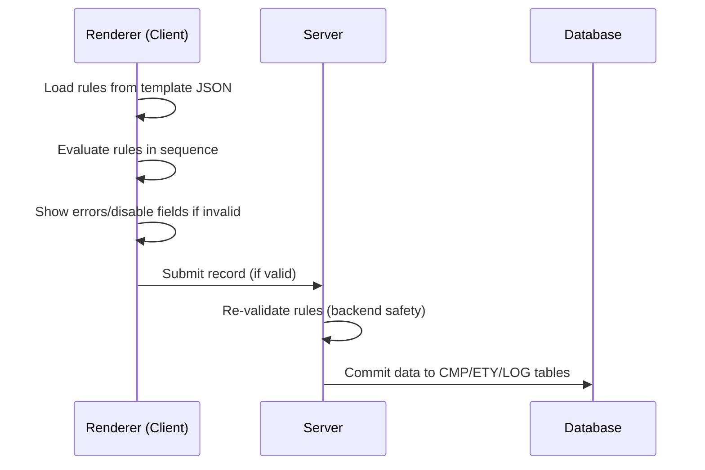

## 15.1 Rule Types  
Defined at the **template level** within each process:

- **Visibility**  
  Hide or disable fields based on conditions  
  _Example:_ `IF outcome = "NO_ANSWER" THEN hide duration_minutes`

- **Validation**  
  Field or cross-field constraints
  
    - `required`
    - `unique`
    - `regex`
    - `min/max`
    - `IF duration_minutes > 30 THEN require notes`

- **Actions**  
  Trigger automatic operations when conditions are met
   
    - Notifications  
    - Write-through to linked records  
    - Spawn child processes  
    - Generate auto-codes (e.g. DNA, TSK IDs)

---

## 15.2 Execution Flow  



---

## 15.3 Safety Model
- **Client-side validation** ensures UX flow and field-level feedback
- **Server-side re-validation** guarantees integrity (even via API or script)
- **Invalid commits are rejected** with logged rule failure messages

```js
// Example server-side rule check
if (record.duration_minutes > 30 && !record.notes) {
  throw new Error("Rule failed: Notes required for long calls");
}
```
